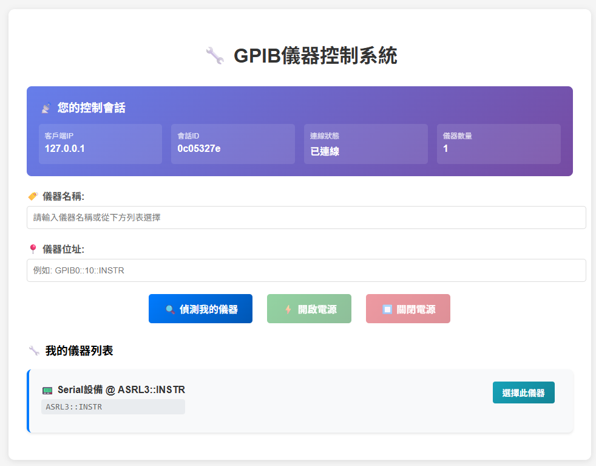

# DCO TW ATE GUI

## Goal: Create a GUI to suport DC/DC test report automation.

## Architecutre:

    ## client - server
    * server -> run app_server.py
    * client -> run app_client.py and goes to server webstie

## Hardward: Rack ATE1

    * DC source: Chroma 62012P-100-50
    * DC load : Chroma XXXXX
    * DC load : Chroma 63600

### Server website UI example

